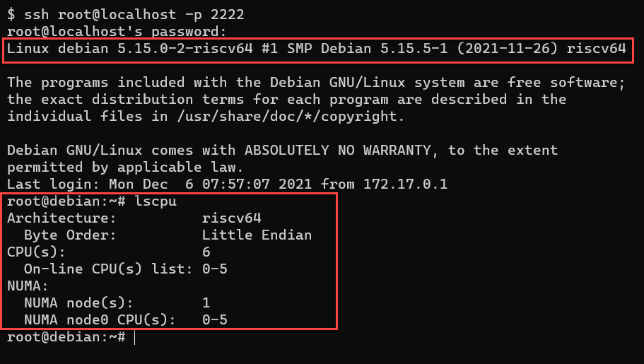

# RISC-V emulator docker image

A pre-configured QEMU & Debian RISC-V image. Allows you to get started working on an emulated RISC-V environment. Is a quick way to see what libraries and frameworks work on RISC-V without sourcing hardware.

Structure:

- Debian host (debian:sid)
  - QEMU. Running as emulated RISC-V with soft-mmu support
    - Debian guest. RISC-V image
    - RISC-V u-boot kernel

## How to use

### Quicker start, with Docker Hub:

Pull and run the image from Docker Hub. Saves you needing to build locally 
 - <https://hub.docker.com/r/davidburela/riscv-emulator>

### Quick start:

#### Get the the image

```bash
# 1 Get the image [2 options]
# 1A. Pull the image from Docker Hub
docker pull davidburela/riscv-emulator

# 1B. -OR- build the image locally
docker build -t davidburela/riscv-emulator .

# 2. 
# Run with QEMU default of 2CPU & 2G ram. 
# Expose port 2222 which is routed through into the QEMU RISC-V guest
docker run -d --publish 127.0.0.1:2222:2222/tcp davidburela/riscv-emulator

# 3. SSH directly into the QEMU RISC-V guest, the default password is "root". (Might take a few minutes for guest to start)
ssh root@localhost -p 2222
```



### Options (RAM, CPU, etc)

```bash
# 2. Alternative: Allocate more CPU / RAM to QEMU guest
# Start the container, and manually start QEMU with the required specs.
# replace AAAA with desired cpus (e.g. 2 or 4)
# replace BBBB with desired RAM (e.g. 2G or 4G)
docker run -d --publish 127.0.0.1:2222:2222/tcp davidburela/riscv-emulator qemu-system-riscv64 -smp AAAA -m BBBB -cpu rv64 -nographic -machine virt -kernel /usr/lib/u-boot/qemu-riscv64_smode/uboot.elf -device virtio-blk-device,drive=hd -drive file=artifacts/image.qcow2,if=none,id=hd -device virtio-net-device,netdev=net -netdev user,id=net,hostfwd=tcp::2222-:22 -object rng-random,filename=/dev/urandom,id=rng -device virtio-rng-device,rng=rng -append "root=LABEL=rootfs console=ttyS0"
```

### Podman

Declare docker.io registry declared in /etc/containers/registries.conf, i.e.

```conf
[registries.search]
registries = [ 'docker.io', 'quay.io' ]
```

Build with

```bash
podman build -t riscv-emulator
```

For other docker sub-commands, just replace `docker` with `podman`

## Example uses

I have used the emulated environment to verify if Open Source projects run on RISC-V, and shared the findings:
- [Golang](https://blog.davidburela.com/2020/11/21/cross-compiling-golang-for-risc-v/)
- [IPFS](https://blog.davidburela.com/2020/11/16/ipfs-on-risc-v/)
- [Ethereum](https://blog.davidburela.com/2020/12/03/ethereum-on-risc-v/)

## How it was built

- Was built based on the steps in my blog post <https://blog.davidburela.com/2020/11/15/emulating-risc-v-debian-on-wsl2/>
- Utilising [Giovanni Mascellani’s prebaked Debian images](https://www.giovannimascellani.eu/dqib-debian-quick-image-baker.html)
